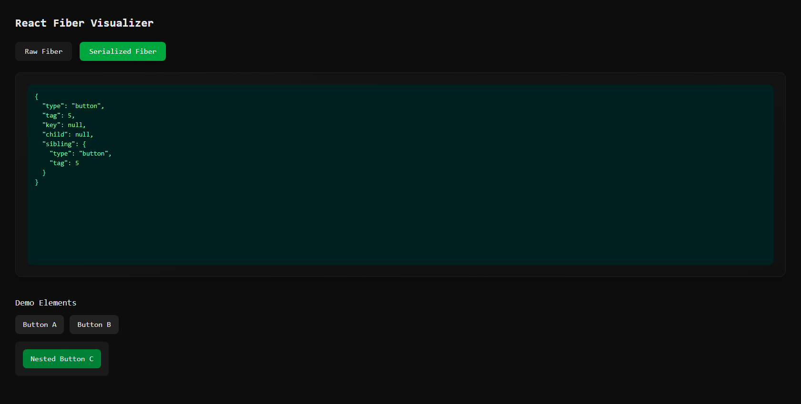
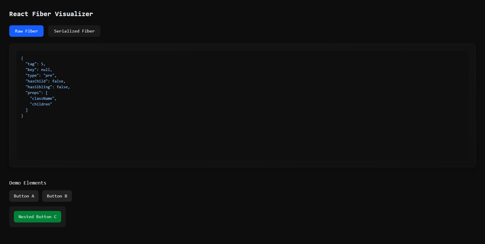

## fiber-viz
----------------------

Fiber-viz is a small experimental tool built purely for learning and exploration.
Its purpose is to understand how React’s Fiber architecture works internally by allowing you to click on elements in the UI and instantly inspect the Fiber node attached to them.

This project is intentionally minimal, lightweight, and focused only on making the internal Fiber structure visible in a safe, simplified format.

**Click any React-rendered DOM element to inspect its Fiber node**

**Two visualization modes:**

**Raw Fiber Summary - readable, safe breakdown of the internal Fiber object**

**Serialized Fiber Tree - a depth-limited structural view**

**Implemented using plain React + TailwindCSS**

**Optimized to avoid browser freezes**

**Designed purely for React internals learning / debugging experiments**

React’s Fiber architecture is powerful but not directly visible.
This tool gives a simple interface to see how React links DOM nodes to Fiber nodes and observe internal fields like tag, type, lanes, flags, child/sibling relationships
and also visualize the tree-like structure React uses during reconciliation

It’s simply a hands-on way to explore the system behind React’s rendering.

-----------------------------------------------------------------------------------------------------

## Installation

git clone https://github.com/Omaima-Ameen/fiber-viz

cd fiber-viz
npm install
npm run dev   # For Vite

or

npm start     # CRA

## How React Fiber Works 

React Fiber is the internal data structure React uses to manage updates.
Every DOM element rendered by React is linked to a hidden Fiber node stored inside the element:

__reactFiber$<randomId>

Each Fiber node contain, the component type, props & state , parent fiber (return) , first child (child), next sibling (sibling), effect flags , lane (priority) information

React uses this structure to schedule, pause, resume, and prioritize rendering work.
fiber-viz exposes a safe, summarized version of this structure so you can see
how React organizes updates under the hood.

  

  

Notes

Uses React's private internals (__reactFiber$), which may change between versions

Intended only for learning and debugging React’s internal behavior !!
